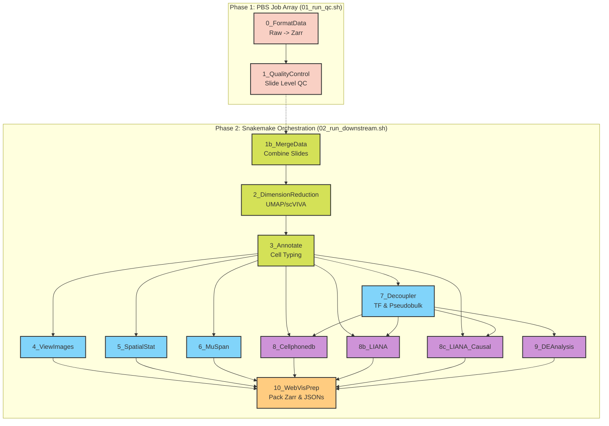

# scSpatial-Kit

An end-to-end Python pipeline for the processing, analysis, and visualization of Spatial Transcriptomics data. Built specifically to handle **NanoString CosMx** and **10x Genomics Xenium** datasets, this pipeline uses modern spatial data frameworks (spatialdata, scanpy, squidpy), advanced spatial statistics (muspan), downstream TF/CCC Analysis, and Causal Network Inference. 

More visual indepth explanation of the pipeline presented [here](https://docs.google.com/presentation/d/1k17lRxf43-NQRZWIfLpKvocqIi1PN-YfwAcD-urLCCc/edit?usp=sharing). 

## 🔑 Key Features

- Non linear Dimension reduction with [scVI](https://docs.scvi-tools.org/en/1.3.3/user_guide/models/scvi.html#), [scANVI](https://docs.scvi-tools.org/en/1.3.3/user_guide/models/scanvi.html), and [scVIVA](https://docs.scvi-tools.org/en/1.3.3/user_guide/models/scviva.html)
- Supports both Machine Learning-based  ([CellTypist](https://www.celltypist.org/)) and Marker-based ([ScType](https://github.com/kris-nader/sc-type-py)) cell type annotation.
- Generates Delaunay, KNN, and Proximity graphs, along with cross-Pair Correlation Functions (PCF), and cell morphological metrics via the [SquidPy](https://squidpy.readthedocs.io/en/stable) and [MuSpAn](https://www.muspan.co.uk/) library.
- Transcription factor activity inference via [DecoupleR](https://decoupler.readthedocs.io/en/latest/index.html) and targeted pseudobulk Differential Expression using PyDESeq2.
- Cell-Cell Communication (CCC) & Causal Networks - Broad microenvironment CCC via [CellphoneDB](https://cellphonedb.readthedocs.io/en/latest), continuous spatial CCC via LIANA+, and downstream causal signaling cascade inference via Corneto.
- Prepares and packages all results (Zarr, JSON) into a `.tar` archive for local exploration using the [Spatial-VisKit](https://github.com/kitku15/Spatial-VisKit) React web application.
- Run pipeline reproducibly on HPC clusters (or locally) using Apptainer/Singularity containers, controlled via TOML configuration files.
- **Dual Execution Modes:** Run the pipeline end-to-end via **Snakemake** for automated parallel DAG resolution, or execute modules directly using the built-in Python orchestrator (`__main__.py`)—perfect for manual debugging or managing massive HPC PBS/Slurm Job Arrays.
- Start from raw machine outputs, or use your own pre-processed .h5ad file.

## ⭐ Pipeline Structure
The workflow is divided into two phases:



### 1️⃣ Data Formating and Quality Control 
Modules:
1. `0_format`
2. `1_QualityControl`

*Details:* Uses one config file per slide/batch so you can adjust QC thresholds independently. Supports parallel processing on HPC array jobs.

### 2️⃣ Downstream Analysis
Modules:

- `1b_MergeData`: Merges all slides into a single AnnData object.
- `2_DimensionReduction`: scVI, scANVI, scVIVA, UMAP, and Leiden clustering.
- `3_Annotate`: CellTypist, ScType, and marker gene identification.
- `4_ViewImages`: Spatial embedding plots, ROI grid generation, and gene expression mapping.
- `5_SpatialStat`: Squidpy (Centrality Scores, Co-occurrence, Neighborhood Enrichment, Moran's I).
- `6_MuSpan`: Cross-PCF, Graph Construction, Shape/Morphology, and Cell Proximity Analysis.
- `7_Decoupler`: TF activity inference (CollecTRI/DoRothEA) and pseudobulk generation.
- `8_Cellphonedb`: Standard microenvironment-based CCC.
- `8b_LIANA`: Bivariate spatial CCC and NMF signaling programs.
- `8c_LIANA_Causal`: Condition-specific causal networks connecting LR pairs to TFs (via Corneto).
- `9_DEAnalysis`: Targeted pairwise pseudobulk differential expression.
- `10_WebVis`: Compiles and optimizes outputs (Zarr, JSON) for Spatial-VisKit.

Additional:
- Merges all slides into one anndata object
- One config file
- slide/batch correction handled by scVI and scVIVA


## Configuration Files
The pipeline uses `.toml` files. You need two of these: one for **Data Formatting & Quality Control (Module 0 & 1)**, and one for downstream analysis.

### Config File 1: Data Formatting and Quality Control
You only need **one config file** for an entire batch of slides/samples. If you need different QC thresholds for specific slides, separate them into different folders and create a config file for each folder.

<details>
<summary>Adding Metadata</summary>
You can have one master metadata CSV for your entire project (ideal for Xenium). You can also have one metadata CSV for each slide (ideal for CosMx). You control how this file merges with your spatial data using two parameters in your config:

- `fov_metadata_path`: The absolute or relative path to your metadata CSV. *(You can use the `{slide_name}` placeholder in the path so the pipeline automatically grabs the correct file for each slide!)*
- `metadata_join_col`: The column name that exists in both your CSV and your data, which the pipeline will use to link them together.
</details>

<details>
<summary>Example 1: CosMx</summary>

For CosMx, each slide is its own folder containing the raw CSV files and its specific metadata CSV. 
```text
data/
└── raw_cosmx/
    ├── Slide_1/
    │   ├── *exprMat_file.csv
    │   ├── Slide_1_metadata.csv
    ├── Slide_2/
    │   ├── *exprMat_file.csv
    │   ├── Slide_2_metadata.csv
```


```toml
log_level = "INFO"
seed = 42

[project]
analysis_name = "CosMx_Project" 
data_type = "CosMx" 
batch_key = "Slide_ID"  
sample_key = "Sample_ID" 

[io]
# Point to the parent directory containing all your slide folders
base_raw_dir = "data/raw_cosmx" 
base_zarr_dir = "data/zarr_outputs"

[pipeline] 
modules = ["0_format", "1_QualityControl"]

[modules.QualityControl]
# --- QC Thresholds ---
min_counts = 50    # Minimum total transcripts for a cell 
min_cells = 5      # Minimum number of cells a gene must be expressed in
min_dapi = 100     # Minimum DAPI signal for a cell
min_area = 500     # Minimum cell area
max_area = 15000   # Maximum cell area

# --- Metadata Integration ---
# Use the {slide_name} placeholder so the pipeline automatically finds the right CSV for each slide folder!
fov_metadata_path = "data/raw_cosmx/{slide_name}/{slide_name}_metadata.csv"
# For CosMx, we typically join clinical data based on the FOV number
metadata_join_col = "fov" 
```
</details>

<details>
<summary>Example 2: Xenium Workflow</summary>
Xenium datasets are often grouped by "Runs", with individual sample regions nested inside as `output-XETG...` folders. The pipeline looks inside these Run folders to find your samples. 
```text
data/
└── raw_xenium/
    ├── RUN_1/
    │   ├── output-XETG00431_0021045_COPD_R010/
    │   ├── output-XETG00431_0021045_IPF_RBH_2/
    ├── RUN_2/
    │   ├── output-XETG...
```


```toml
log_level = "INFO"
seed = 42

[project]
analysis_name = "Xenium_Project" 
data_type = "Xenium" 
batch_key = "batch"  
sample_key = "slide_id" # This becomes the column storing the folder names

[io]
# Point to the parent directory containing your RUN folders
base_raw_dir = "data/raw_xenium" 
base_zarr_dir = "data/zarr_outputs"

[pipeline] 
modules = ["0_format", "1_QualityControl"]

[modules.QualityControl]
# --- QC Thresholds ---
min_counts = 10    # Minimum total transcripts for a cell 
min_genes = 5      # Minimum unique genes for a cell
min_cells = 5      # Minimum number of cells a gene must be expressed in
min_area = 10      # Minimum cell area
max_area = 500     # Maximum cell area

# --- Metadata Integration ---
# Point this to your master CSV
fov_metadata_path = "/rds/general/user/bth22/ephemeral/Xenium_Project/metadata.csv"
# For Xenium, join on the column that holds your folder names (e.g., 'output-XETG...')
metadata_join_col = "slide_id" 
```
</details>

### Config File 2: Downstream Analysis
Only One configuration file for your merged dataset (merged all slides).

<details>
<summary>Example: config file 2 (`config_downstream.toml`) </summary>

```toml
log_level = "INFO"
seed = 21122023

[project]
analysis_name = "my_CosMx" # THIS MUST BE THE SAME AS WHAT YOU SET IN 01 CONFIG
data_type = "CosMx" # or Xenium
batch_key = "slide_id" 
sample_key = "sample_id"

[io]
base_dir = "."

[io.raw_data]
"Slide_1" = { dataset_dir = "data/tyler_1", zarr_dir = "data/tyler_1.zarr", proseg_zarr_dir = "data/tyler1_proseg.zarr" }
"Slide_2" = { dataset_dir = "data/tyler_2", zarr_dir = "data/tyler_2.zarr", proseg_zarr_dir = "data/tyler2_proseg.zarr" }

[pipeline]
modules = [
    "1b_MergeData", "2_DimensionReduction", "3_Annotate", "4_ViewImages", 
    "5_SpatialStat", "6_MuSpan", "7_Decoupler", "8_Cellphonedb", 
    "8b_LIANA", "8c_LIANA_Causal", "9_DEAnalysis", "10_WebVis"
    ]

[modules.MergeData] # details your individual slides to be merged
input_files = [
    "analysis_tyler_project/1_QualityControl/Slide_1/adata.h5ad",
    "analysis_tyler_project/1_QualityControl/Slide_2/adata.h5ad",
    "analysis_tyler_project/1_QualityControl/Slide_3/adata.h5ad",
    "analysis_tyler_project/1_QualityControl/Slide_4/adata.h5ad"
]
slide_names = ["Slide_1", "Slide_2", "Slide_3", "Slide_4"] # everything you set for slide_name in all your slide configs

[modules.DimensionReduction]
use_scviva = false
n_neighbors = [5, 10, 30, 50] # list of no. of neighbours parameter for neighbourhood graph   
resolution = [0.5, 1.0, 1.5, 2.0] # list of resolution parameter for leiden clustering 
cluster_name = "leiden" # dont change this
run_pca = true # do you want to see a PCA plot? (true/false)
n_comps = 50 # if yes how many PCs do you want plotted?
cluster_name = "leidenpca"
run_pca = true
n_comps = 50     
umap_latent = "X_pca"
scvi_epochs = 400

scviva_layer = "counts"
scviva_batch_key = "slide_id" 
scviva_spatial_knn = 10
scviva_epochs = 400

[modules.Annotate]
chosen_cluster = "leiden_n10_r1.0" # your favorite clustering column from the DR module

# ScType Config:
ScType_anno = true # do you want to run ScType? (true/false)
ScType_mode = "All" # do you want ScType Annotation to be done for all ("All") clustering columns or just the one you chosen_cluster? ("one")
ScType_custom_db = "" # you can insert your own marker db here 
ScType_tissue = "Intestine" # ScType Tissue - look inside ScType_db/ScTypeDB_full.xlsx

# CellTypist Config:
CellTypist_anno = true # do you want to run CellTypist? (true/false)
CellTypist_mode = "All" # do you want CellTypist Annotation to be done for all ("All") clustering columns or just the one you chosen_cluster? ("one")
CellTypist_model = "Cells_Intestinal_Tract" # CellTypist model of choice 

[modules.ViewImages]
# list of genes you want to view spatially on each sample
gene_list = ["HLA-DRB", "KRT8", "TMSB4X", "TFF3", "IGHA1", "COX1"]

[modules.MuSpan]
selection_name = "myMuSpan" # make a selection name for MuSpan
cell_types = [0, 1] # select 2 cell types you want analysis on

# list of genes to visualize on MuSpan plots 
transcripts = ["HLA-DRB", "KRT8", "TMSB4X", "TFF3", "IGHA1", "COX1"]

# MuSpAn Spatial Graphs config
min_edge_distance = 0
max_edge_distance = 200
distance_list = [50, 90, 120]
min_edge_distance_shape = 0
max_edge_distance_shape = 1
k_list = [2, 5, 10, 15]

# MuSpAn Cell Proximity Analysis config
cellboundary_label = 'Cell boundaries' 
max_distance = 200 # Threshold for contact
network_celltypes = ["0", "1", "2", "3"]

[modules.Decoupler]
organism = "human" # or mouse
grn = "dorothea" # choice of GRN db to use 'dorothea' or 'collectri'
dorothea_levels = ["A", "B", "C"] 

[modules.Cellphonedb]
no_microenv = 20 # how many physical microenvironments to split the slide on
chosen_cluster = 'CellTypist_majorityvoting_leiden_n10_r1.0' # cell type annotation column to use
cpdb_version = 'v5.0.0'
human = true # if false, mouse is assummed 
celltypes = ["IgA plasma cell", "BEST2+ Goblet cell"] # cell types you want dot and chord plots for


[modules.LIANA_Causal]
celltype_col = "Final_Annotation"
treatment_col = "TreatmentResponse"
comparisons = [["CPIc", "Healthy"], ["IFX_NR", "Healthy"]]
cell_type_pairs = [["Macrophage", "CD8 T cell"], ["B Cells", "T Cells"]]

[modules.DEAnalysis]
celltype_col = "Final_Annotation"
treatment_col = "TreatmentResponse"
comparisons = [["IFX_NR", "IFX_R"], ["CPIc", "Healthy"]]

[modules.WebVisPrep]
primary_annotation = "Final_Annotation"
microenv_col = "spatial_microenvironment"
annotation_columns = ["leiden", "Final_Annotation", "Broad_Celltype"]

```
</details>

<details>
<summary>Example: Using your own preprocessed .h5ad file and skip other modules</summary>
```toml
[io]
base_dir = "."
entry_point = "8b" # E.g., Start directly at LIANA+ CCC
custom_input_adata = "data/my_preprocessed_dataset.h5ad"
```
</details>


## ⭐ Inputs
These dataset folders need to be in the data directory
### 🔘 Xenium 10X

Example below showing one slide. Need to refine.

```toml
# check this below if everything is really needed
MyXeniumDataset/
├── morphology_focus/
├── analysis_summary.html
├── analysis.tar.gz
├── analysis.zarr.zip
├── aux_outputs.tar.gz
├── cell_boundaries.csv.gz
├── cell_boundaries.parquet
├── cell_feature_matrix.h5
├── cell_feature_matrix.tar.gz
├── cell_feature_matrix.zarr.zip
├── cells.csv.gz
├── cells.parquet
├── cells.zarr.zip
├── experiment.xenium
├── gene_panel.json
├── metrics_summary.csv
├── morphology.ome.tif
├── nucleus_boundaries.csv.gz
├── nucleus_boundaries.parquet
├── transcripts.csv.gz
├── transcripts.parquet
└── transcripts.zarr.zip
```

### 🔘 CosMx NanoString
Example below showing 2 slides. `dataset_id` (for 1st config file) for MyCosMxDataset_1 is MyCosMxDatasetSlide1. `dataset_id` for MyCosMxDataset_2 is MyCosMxDatasetSlide2.

```toml
MyCosMxDataset_1/
├── CellComposite/ # these could be empty 
├── CellLabels/ # these could be empty 
├── MyCosMxDatasetSlide1_exprMat_file.csv
├── MyCosMxDatasetSlide1_fov_cohort.csv
├── MyCosMxDatasetSlide1_fov_positions_file.csv
├── MyCosMxDatasetSlide1_metadata_file.csv
├── MyCosMxDatasetSlide1_tx_file.csv
└── MyCosMxDatasetSlide1-polygons.csv
MyCosMxDataset_2/
├── CellComposite/ # these could be empty 
├── CellLabels/ # these could be empty 
├── MyCosMxDatasetSlide2_exprMat_file.csv
├── MyCosMxDatasetSlide2_fov_cohort.csv
├── MyCosMxDatasetSlide2_fov_positions_file.csv
├── MyCosMxDatasetSlide2_metadata_file.csv
├── MyCosMxDatasetSlide2_tx_file.csv
└── MyCosMxDatasetSlide2-polygons.csv
```
⚠️ **WARNING!**: make sure your `*metadata_file.csv` does not have both `cell_id` and `cell_ID` or any other case variation of `cell_id`. If this is the case, a simple python script can just rename one of them. 

## ⭐ Getting Started

### 1. Run Data Formatting and QC

Adjust settings in your job script (`01_run_qc.sh`), and set parameters in your config file. The script leverages PBS arrays to process multiple slides in parallel.
```bash
# Inside 01_run_qc.sh
CONFIG_NAME="config_qc.toml" # path to config file 1
SIF_IMAGE="$(readlink -f kitku.sif)" # singularity image

apptainer run --writable-tmpfs -W "$APPTAINER_WORKDIR" \
  --bind "$PBS_O_WORKDIR:/app" \
  "$SIF_IMAGE" \
  "$CONFIG_NAME" --modules 0 1
```
Then to queue the job, run on the command line:
```bash
qsub 01_run_qc.sh
```
### 2. Run Downstream Analysis

Once the QC jobs finish, configure `config_downstream.toml` and submit the downstream script (`02_run_downstream.sh`). You can run all modules at once, or incrementally. 

```bash
# Inside 02_run_downstream.sh
CONFIG_NAME="config_downstream.toml" # path to your 2nd config file
SIF_IMAGE="$(readlink -f kitku.sif)" # singularity image

# Get the number of CPUs allocated by PBS
NCPUS=$(cat $PBS_NODEFILE | wc -l 2>/dev/null || echo 32)

apptainer exec --writable-tmpfs -W "$APPTAINER_WORKDIR" \
  --bind "$PBS_O_WORKDIR:/app" \
  "$SIF_IMAGE" \
  python Modules/run_pipeline.py "$CONFIG_NAME" --cores $NCPUS
```
Then to queue the job, run on the command line:
```bash
qsub 02_run_downstream.sh
```
## Pipeline Orchestration & Modifying Parameters

- **Config mistake**: If the pipeline crashes on because of a typo in your config, fix the typo in the .toml and run `qsub 02_run_downstream.sh` again. The pipeline will skip them finished modules and resume exactly where it left off.
- **Running a subset of modules**: Change the modules = [...] list in the TOML to only include modules you want to run.
- **Recalculating with new parameters**: If you change a parameter (e.g., Leiden resolution) and want to rerun from that step onwards, delete or rename the output folder (e.g., rm -rf analysis_myproject/2_DimensionReduction). When you run the pipeline, Snakemake will see the folder is missing, rerun Module 2, and automatically cascade the updates to all downstream modules.


## ⭐ Outputs
The pipeline generates a highly organized output directory. Module 10 packages the necessary files into a `.tar` archive optimized for the [Spatial-VisKit](https://github.com/kitku15/Spatial-VisKit) Web App.
```text
{analysis_name}_analysis/
├── 1_QualityControl/
│   ├── Slide_1/             # QC plots, histograms, and filtered adata.h5ad
│   └── Slide_2/  
├── 1b_MergeData/            # Merged dataset containing all slides
├── 2_DimensionReduction/    # PCA, UMAP, and scVIVA embeddings
├── 3_Annotate/              # CellTypist/ScType annotations & marker genes
├── 4_ViewImages/            # Spatial tissue plots and ROI grid definitions
├── 5_SpatialStat/           # Squidpy neighborhood enrichments & Moran's I
├── 6_MuSpan/                # MuSpAn graphs, PCF, and Morphometrics per ROI
├── 7_Decoupler/             # TF activities and Pseudobulk generation
├── 8_Cellphonedb/           # CellPhoneDB dot/chord plots
├── 8b_LIANA/                # Bivariate spatial CCC & NMF components
├── 8c_LIANA_Causal/         # Corneto causal networks & pathway CSVs
├── 9_DEAnalysis/            # PyDESeq2 condition-specific DE outputs
├── 10_WebVis/               # Web-optimized JSONs, Vitessce Zarrs, and Sankeys
└── logs/                    # Comprehensive logs and runtime trackers (.csv)
```


## ⭐ About
This 22-week project was completed as part of the MRes in Bioinformatics and Theoretical Systems Biology at Imperial College London. It builds upon the [The ReCoDe-spatial-transcriptomics repository](https://github.com/ImperialCollegeLondon/ReCoDe-spatial-transcriptomics). The work was supervised by Tamas Korcsmaros and Balazs Bohar.

- 😸 Author: Bunga Tiasyaira Hutasuhut (Syaii) 
- 📩 Academic Email: bth22@ic.ac.uk
- 📮 Personal Email: bungatiasyaira@outlook.com

