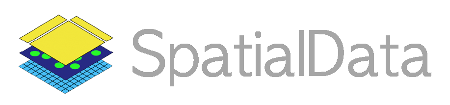
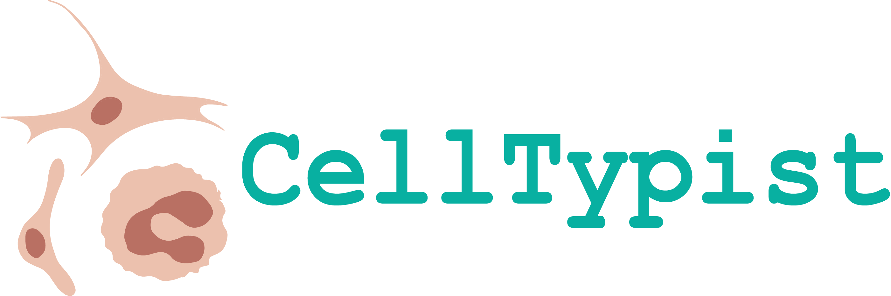
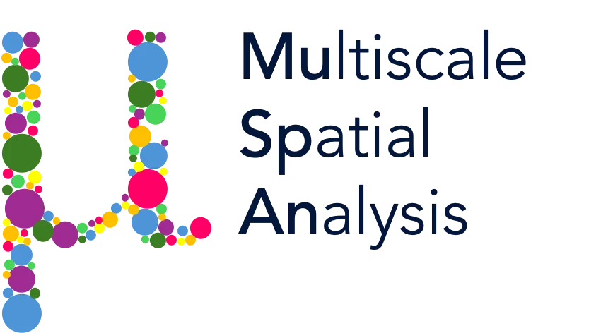
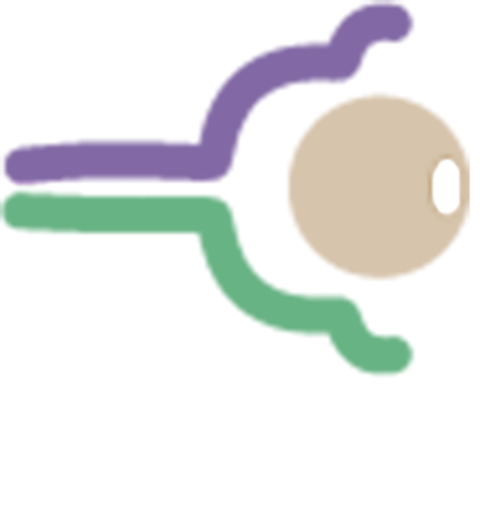
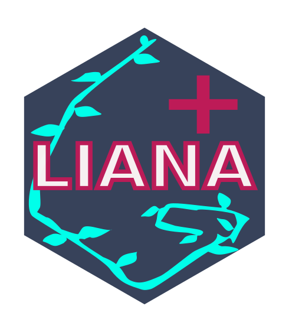

# scSpatial-Kit

<a href="https://github.com/korcsmarosgroup/Spatial-Transcriptomics-CosMx-Xenium" target="_blank" rel="noopener noreferrer">scSpatial-Kit</a> (single-cell Spatial Transcriptomics Kit) is an end-to-end, modular, scalable, and reproducible bioinformatics pipeline designed for sub-cellular resolution spatial transcriptomics. It takes raw vendor data, performs quality control, leverages state-of-the-art deep learning for dimension reduction, infers cell-cell communication, and ultimately packages results for interactive web visualization with [Spatial-VisKit](svk/home.md).

[Get Started](getting-started/installation.md){ .md-button .md-button--primary }
[Configuration Guide](getting-started/configuration.md){ .md-button }

---

## Key Features

-   :material-dna: **Supports Major Platforms**
    
    ---
    Currently accepts raw datasets from [**NanoString CosMx**](https://brukerspatialbiology.com/products/cosmx-spatial-molecular-imager/) and [**10x Xenium**](https://www.10xgenomics.com/platforms/xenium).

-   :material-toolbox-outline: **Comprehensive Spatial Toolkit**
    
    ---
    Uses **scVI / scVIVA** for spatially-aware deep learning embeddings. Features geometric morphometrics via **MuSpAn**, neighborhood statistics via **Squidpy**, causal signaling via **LIANA+**, and Transcription Factor inference via **Decoupler**.

-   :material-sitemap: **Automated & Reproducible**
    
    ---
    Orchestrated via **Snakemake** and tracks execution times and logs the exact parameters used for every module, ensuring your spatial analyses are traceable and reproducible.

-   :material-monitor-dashboard: **Paired Visualization Tool**
    
    ---
    Instantly export your into our web application, [**Spatial-VisKit**](svk/home.md), to explore your tissue and analysis results interactively.

---

## Pipeline Architecture

scSpatial-Kit is divided into multiple modules. You can run the entire pipeline end-to-end, or only run specific modules.

### 1: Pre-Processing & Quality Control {#hide-me}
* **[Module 0: Format Data](modules/0_format.md)** — Parses raw datasets into SpatialData format.
* **[Module 1: Quality Control](modules/1_qc.md)** — Filters debris/artifacts.
* **[Module 1b: Merge Data](modules/1_qc.md)** — Merges multiple batches/slides into one dataset.

### 2: Dimensionality & Annotation {#hide-me}
* **[Module 2: Dimension Reduction](modules/2_dimreduc.md)** — Performs dimension reduction, has many options. 
* **[Module 3: Cell Annotation](modules/3_annotation.md)** — Supports many methods for cell type annotation and finds marker genes.
* **[Module 4: Spatial Visualization](modules/4_view_images.md)** — Plots annotations and marker genes onto UMAP and physical tissue coordinates.

### 3: Spatial & Microenvironment Analytics {#hide-me}
* **[Module 5: Spatial Statistics](modules/5_spatial_stats.md)** — Computes spatial metrics (Neighborhood Enrichment, Co-occurrence, Moran's I).
* **[Module 6: MuSpAn](modules/6_muspan.md)** — Computes spatial metrics, cell morphometrics (area, perimeter, orientation), and exact physical contact networks.
* **[Module 7: TF Enrichment](modules/7_decoupler.md)** — Infers Transcription Factor activity.

### 4: Communication & Differential Expression {#hide-me}
* **[Module 8: Cell-Cell Communication](modules/8_ccc.md)** — Evaluates ligand-receptor crosstalk, signalling niches, and causal intracellular signaling.
* **[Module 9: Condition DE Analysis](modules/9_de_analysis.md)** — Performs differential expression analysis between conditions.
* **[Module 10: WebVis Export](modules/10_webvis.md)** — Packages results for interactive web visualization.

---

## Powered By

scSpatial-Kit seamlessly integrates many open-source tools in the single cell and spatial bioinformatics ecosystem:

  
  
  

  

  

  

  

  

  <a href="https://cellphonedb.readthedocs.io/" target="_blank" class="tool-badge">
    
    CellPhoneDB
  </a>

  

  

  

  

